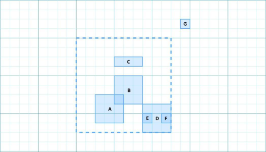
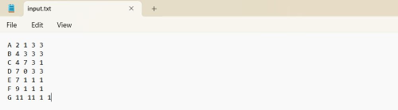
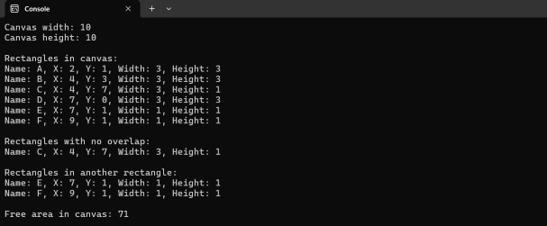

# Rectangle Analysis System 🧮

## Overview
A performant C# solution for analyzing geometric relationships between rectangles on a user-defined canvas. The system provides:

- 🔒 Comprehensive input validation
- 📐 Multiple geometric analysis modes
- ⚡ Efficient algorithms to determine geometrical relationships
- 🏗️ Clean, maintainable architecture

## Features

### Input Processing
- ✔️ Interactive console interface for canvas dimensions  
- ✔️ Batch processing of rectangles from input files  
- ✔️ Silently skips invalid rectangles
- ✔️ Robust validation pipeline  

- 
- 

### Geometric Analysis
- ✔️ Containment detection (canvas bounds)  
- ✔️ Overlap identification  
- ✔️ Full inclusion checking  
- ✔️ Uncovered area calculation using SortedList for active interval tracking 



### Performance
- ✔️ Optimized algorithms (O(n log n) sweep line)
- ✔️ In-memory processing  
- ✔️ Scalable architecture  

## Technical Specifications

### Input Requirements
| Parameter | Format | Validation |
|-----------|--------|------------|
| Canvas Width 📏 | Positive integer | 0 ≤ x ≤ 2³¹-1 |
| Canvas Height 📏 | Positive integer | 0 ≤ y ≤ 2³¹-1 |
| Rectangle Data 📋 | Space-separated: `Name X Y W H` | File existence, format compliance |

### Algorithmic Complexity
| Operation | Complexity | Notes |
|-----------|------------|-------|
| Canvas Containment | O(n) | Linear scan |
| Overlap Detection | O(n²) | Pairwise comparison |
| Inclusion Check | O(n²) | Boundary analysis |
| Area Calculation | O(n log n) | Sweep line algorithm |

## Running the Program

### Prerequisites
- .NET 6.0 or later installed

### Steps
1. Clone the repository:
   ```bash
   git clone https://github.com/dosqas/Mini-Projects.git
   ```

2. Navigate to the project directory:
   ```bash
   cd Mini-Projects/CSharp/Rectangle-Overlap-Checker
   ```

3. Build the solution:
   ```bash
   dotnet build
   ```

4. Run the program:
   ```bash
   dotnet run
   ```

5. Place your input.txt file in the same directory as the executable. Ensure it follows the required format:
   ```bash
   Name X Y Width Height
   Rect1 0 0 10 10
   Rect2 5 5 10 10
   ```

6. Follow the console prompts to input canvas dimensions and analyze the rectangles.


## Limitations ⚠️

1. **Scale Limitations**:
   - 🐌 Pairwise checks become expensive with large datasets (>10,000 rectangles)
2. **Precision Constraints**:
   - 🔢 Integer-only coordinates
3. **Edge Cases**:
   - ⚠️ Zero-area rectangles

## Suggested Improvements 🚀

1. **Performance**:
   - 🌐 Implement spatial partitioning (e.g., quadtree)
   - ⚡ Add parallel processing
2. **Features**:
   - 🎨 Visual output generation
   - 🔍 Support for floating-point coordinates
3. **Robustness**:
   - ✅ Additional file format validation
   - 📝 Detailed error logging